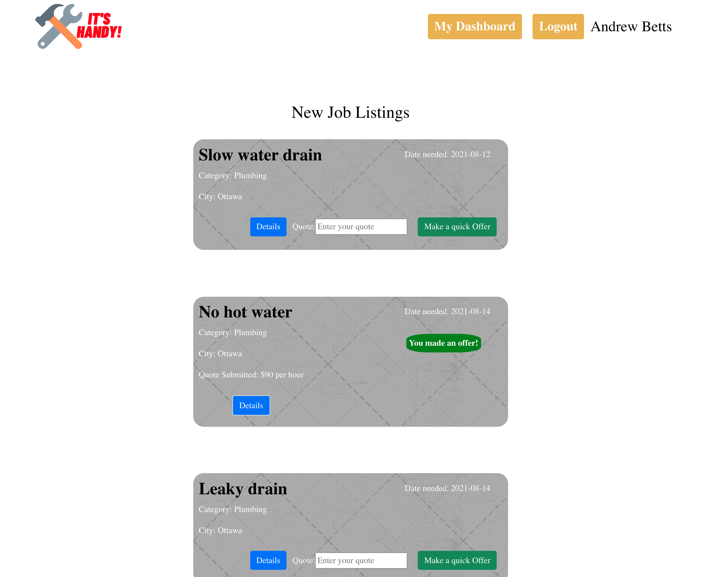
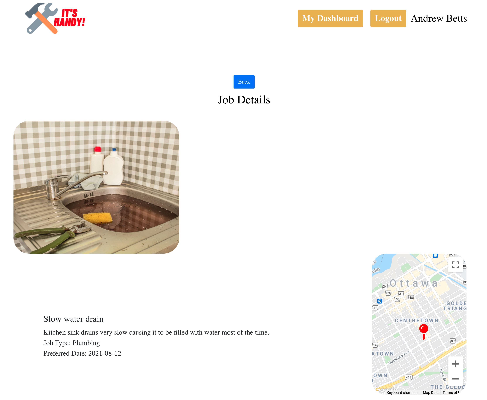
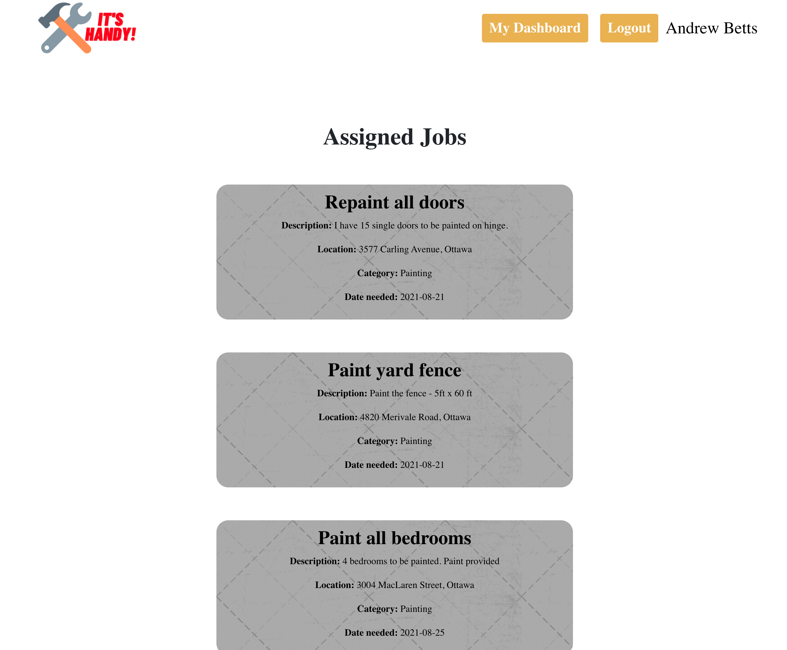
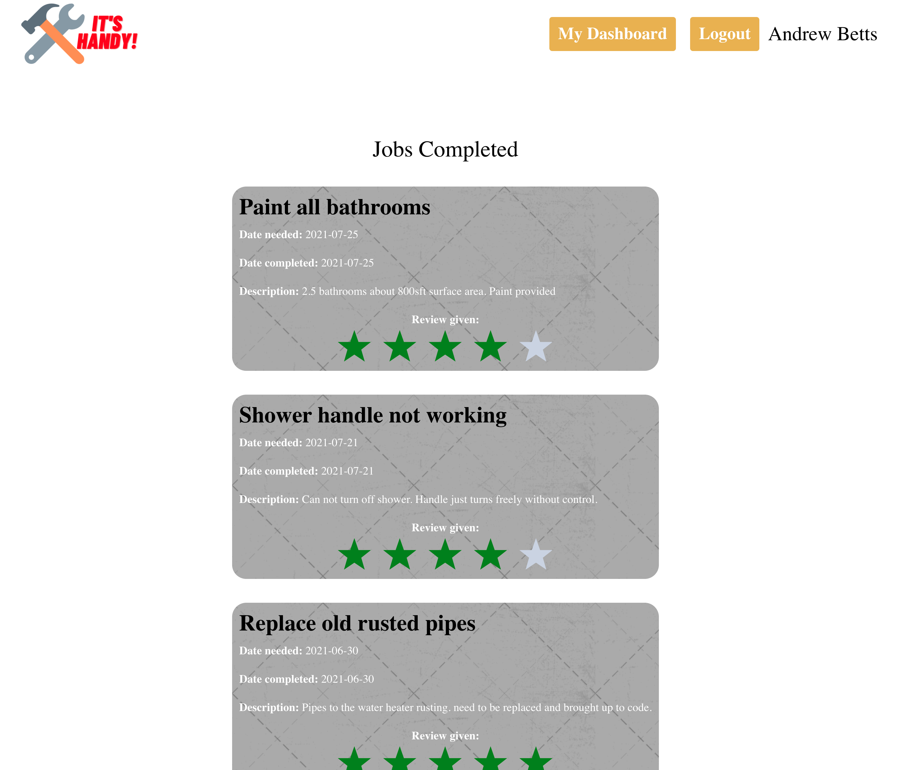
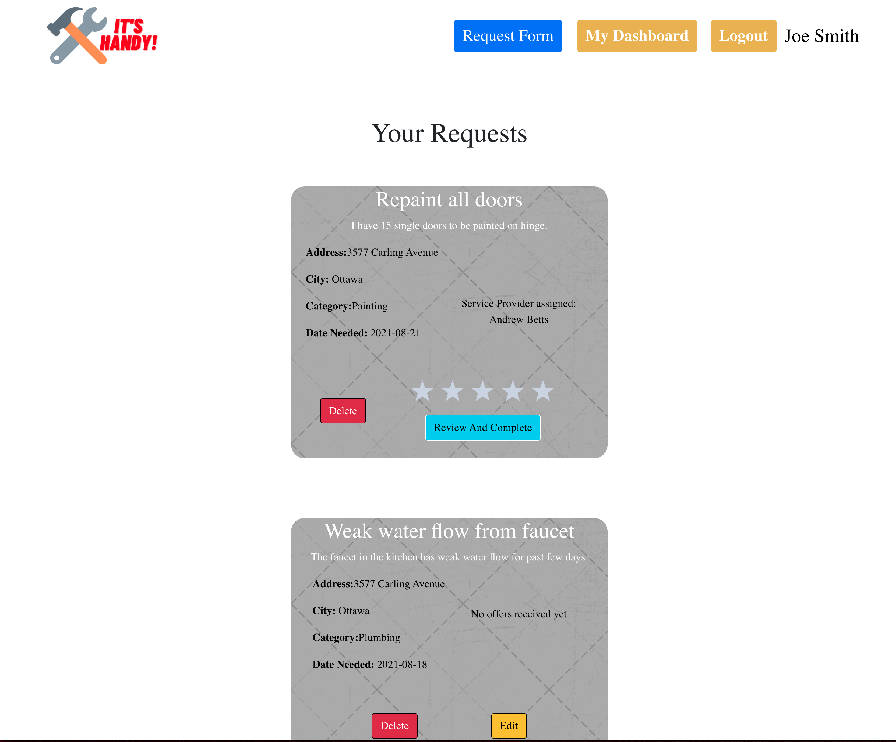
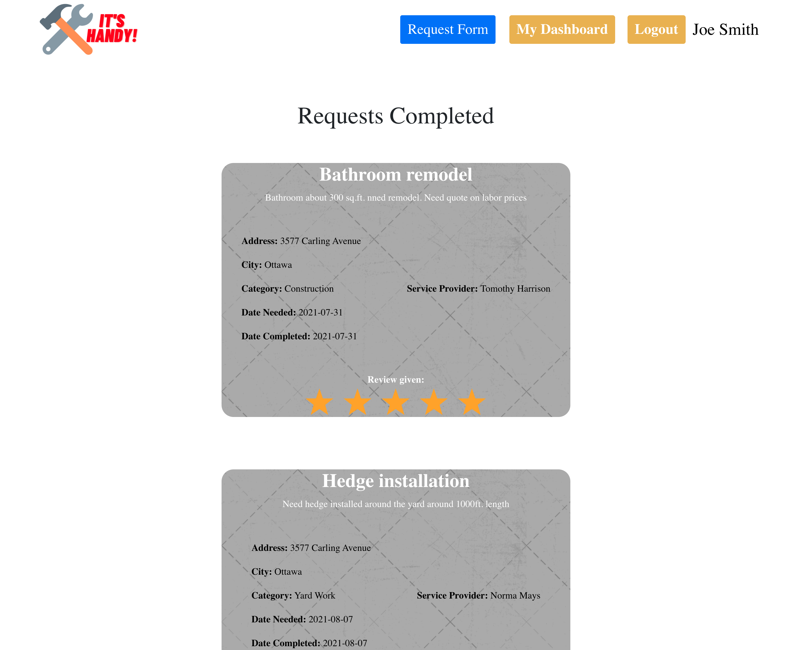

# It's Handy
This is a single page app that allows clients a one stop place to get quotes from mutliple service providers for any jobs they need done. It shows service providers any jobs available that match the work categories they have registered for and allows them to make offers for any jobs. Before making an offer the service provider can see the images uploaded by the client related to the job and also a map showing the location of the job. The client can accept the offer made by the service provider and leave a review for the service provider once the job is completed. An SMS is sent to the client whenever they receive a new offer. Also the service provider receives an SMS when a job has been assigned to them.

# Tech Stack:
ReactJs, Express, NodeJs, PSQL, Bootstrap, SASS, Google Maps API, Cloudinary API, TWILIO SMS API.

## Setup
- Clone the repository.
- Install dependencies with `npm install`.
- Copy .env.example to .env in client and backend_server
- Add DB information, Google API KEY, CLoudinary Account information and TWILIO AUTH TOKEN , SID and outgoing phone number to the respective .env

## Final Product

#### Home Page


## Service Provider
#### Provider Dashboard


#### New Job Listings


#### Job Details Page


#### Assigned Jobs List


#### Completed Jobs


## Client
#### Client Dashboard


#### Current Requests


#### Requests completed


## DB Setup

```sh
npm run db:reset
```

## Running Backend server

```sh
cd backend-express
npm start
```

## Running client React server

```sh
cd client
npm start
```

## Dependencies
#### Client:

- Axios
- React
- react-dom
- react-scripts
- Node Sass
- google-map-react

#### Backend server

- Bcrypt
- cookie-session
- cookie-parser
- CORS
- pg
- twilio

